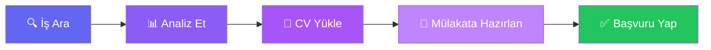

<div align="center">

# 🌟 Jobverse

### Geleceğin Kariyerine Bugünden Hazırlanın

[](https://jobverse.tech)
[](LICENSE)

*İş ilanlarını keşfedin • Kariyer planı yapın • AI destekli mülakat simülasyonları ile hazırlanın*

[✨ Özellikleri Keşfet](#-özellikler) • [🚀 Nasıl Çalışır](#-nasıl-çalışır) • [👥 Ekip](#-ekibimiz) • [🛠️ Teknolojiler](#️-teknolojiler)


</div>

---

## 💫 Nedir Jobverse?

Jobverse, iş arayanların hayallerindeki kariyere ulaşmalarını kolaylaştıran yenilikçi bir platformdur. Binlerce iş ilanını bir arada sunarken, yapay zeka destekli özelliklerle mülakat sürecinizi başarıyla tamamlamanıza yardımcı olur.

<div align="center">

### 🎯 Hedefimiz
**İş arama sürecini daha akıllı, daha kolay ve daha etkili hale getirmek**

</div>

---

## ✨ Özellikler

<table>
<tr>
<td width="50%">

### 🔍 Akıllı İş Arama
Binlerce iş ilanı arasından size en uygun olanları filtreleyin. Konum, maaş, deneyim seviyesi ve daha fazlasına göre arama yapın.

### 📊 Piyasa Analizi
İş piyasası trendlerini takip edin, maaş aralıklarını karşılaştırın, en çok talep gören yetenekleri keşfedin.

### 🤖 AI Mülakat Simülasyonu
Gemini AI ile gerçekçi mülakat soruları alın, cevaplarınızı pratik yapın ve anında geri bildirim alın.

</td>
<td width="50%">

### 💬 Kariyer Asistanı
7/24 AI destekli kariyer danışmanı ile kariyerinizle ilgili tüm sorularınıza anında cevap alın.

### 📄 CV Uyum Analizi
CV'nizi yükleyin, iş ilanlarıyla ne kadar uyumlu olduğunu öğrenin ve gelişim önerilerinizi alın.

### 💾 Kayıt & Takip
Beğendiğiniz iş ilanlarını kaydedin, başvuru süreçlerinizi takip edin.

</td>
</tr>
</table>

---

## 🚀 Nasıl Çalışır?

<div align="center">



</div>

---

## 🛠️ Teknolojiler

<div align="center">

### Frontend


### Backend


### AI & Deployment


</div>

---

## 👥 Ekibimiz

<div align="center">

### Projeyi Hayata Geçiren Yetenekli Ekip

<table>
<tr>
<td align="center" width="33%">
<br />
<sub><b>Hüseyin Enes Ertürk</b></sub><br />
<sub>Backend Developer</sub><br />
<a href="https://github.com/huseyineneserturk">

</a>
</td>
<td align="center" width="33%">
<br />
<sub><b>Alperen Yasemin</b></sub><br />
<sub>Data Analyst</sub><br />
<a href="https://github.com/AlperenYasemin">

</a>
</td>
<td align="center" width="33%">
<br />
<sub><b>İshak Karataş</b></sub><br />
<sub>Frontend Developer</sub><br />
<a href="https://github.com/ishakkaratas05">

</a>
</td>
</tr>
</table>

*Her biri projemize değerli katkılar sundu ve Jobverse'i bugünkü haline getirdi* ✨

</div>

---

## 🎯 Hızlı Başlangıç

### Önkoşullar
- Node.js 18 veya üzeri
- MongoDB Atlas hesabı
- Firebase projesi
- Gemini API anahtarı

### Kurulum

```bash
# 1. Projeyi klonlayın
git clone https://github.com/huseyineneserturk/Jobverse.git
cd Jobverse

# 2. Backend'i başlatın
cd jobverse-backend
npm install
cp .env.example .env
# .env dosyasını API anahtarlarınızla güncelleyin
npm run dev

# 3. Frontend'i başlatın (yeni terminal)
cd jobverse-frontend
npm install
npm run dev
```

### 🌐 Tarayıcınızda açın
```
http://localhost:5173
```

---

## 📸 Ekran Görüntüleri

<div align="center">

*Çok yakında ekleniyor...*

</div>

---

## 🤝 Katkıda Bulunun

Katkılarınızı bekliyoruz! Projeyi geliştirmek için:

1. Bu depoyu fork'layın
2. Feature branch'i oluşturun (`git checkout -b feature/HarikaBirOzellik`)
3. Değişikliklerinizi commit'leyin (`git commit -m 'Harika bir özellik ekle'`)
4. Branch'inizi push'layın (`git push origin feature/HarikaBirOzellik`)
5. Pull Request oluşturun

---

## 📄 Lisans

Bu proje [MIT Lisansı](LICENSE) ile lisanslanmıştır - detaylar için dosyaya bakın.

---

## 📞 İletişim

Sorularınız veya önerileriniz için bizimle iletişime geçin:

<div align="center">

[](mailto:huseyineneserturk@gmail.com)
[](https://jobverse.tech)

</div>

---

<div align="center">

### ⭐ Projeyi Beğendiyseniz Yıldız Vermeyi Unutmayın!

**Jobverse ile kariyerinize yön verin** 🚀

[↑ Başa Dön](#-jobverse)

</div>
